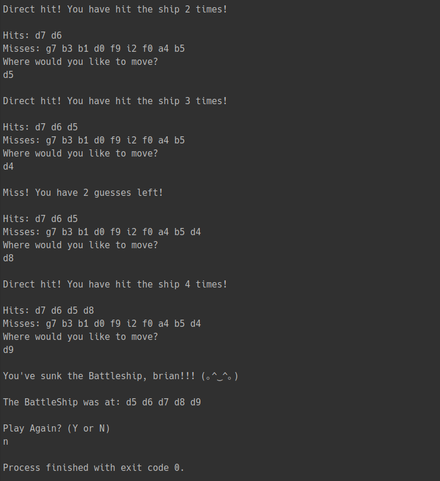

# C# Battleship Game

> Console Battleship game built in C# & .NET

## Summary

I built this app to learn the basics of C# and the .NET framework. This was a very important application for me because C# is going to be my language of choice for writing back end code in future projects.

I know this is an incredibly small and simple application, but it is an important building block for me for the future.

While building this application I learned the following:

> Writing C# syntax

> The importance and functionality of namespaces & classes in C#

> Using the keywords public, private, void & static

> Writing conditional statements & loops in C#

> The differences between arrays & lists and when to use each to store data

> Validating user input

## Author

### Brian Bastanza- Full Stack Web Developer

<a href="https://www.brianbastanza.me/" target="_blank" rel="noopener">Personal Website</a>

[LinkedIn](www.linkedin.com/in/brian-bastanza-9035397b)
